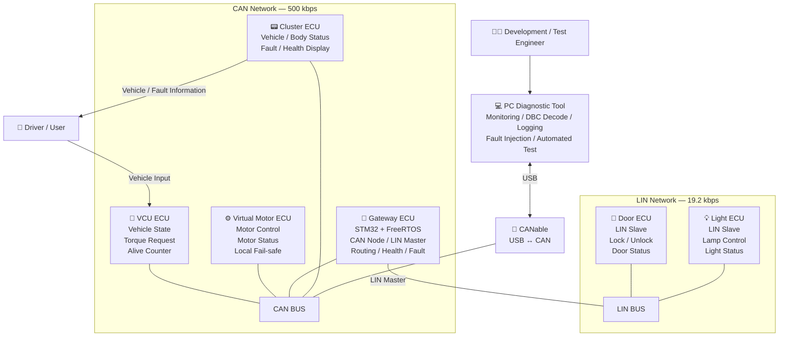
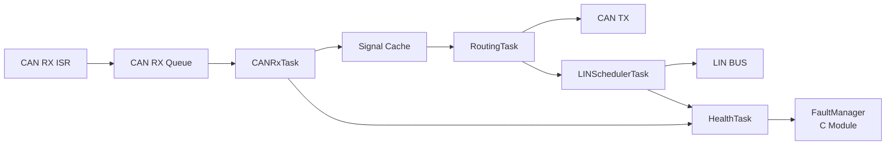

<div align="center">

# FreeRTOS CAN-LIN Gateway Project

**FreeRTOS-based CAN-LIN Gateway for multi-ECU vehicle network**

STM32 기반 분산 ECU · FreeRTOS Gateway · CAN 500 kbps Backbone · LIN 19.2 kbps Subnetwork · Virtual Motor / Door / Light


[프로젝트 개요](#1-프로젝트-개요) · [전체 아키텍처](#2-전체-아키텍처) · [RTOS 구조](#3-rtos-구조) · [개발 문서](#4-개발-문서) · [협업 규칙](#5-협업-규칙)

</div>

> **현재 기준:** CAN-LIN Gateway MVP Architecture  
> **핵심 구조:** VCU / Virtual Motor / Gateway / Cluster on CAN 500 kbps,
> Gateway LIN Master + Door / Light LIN Slave on LIN 19.2 kbps  
> **Fault Handling:** Gateway가 Network Health/Fault를 감지·관리·전파하고,
> 실제 Fail-safe 출력은 영향 ECU가 Local에서 수행  
> **MCU 실행 환경:** Gateway ECU는 STM32 + FreeRTOS 기반으로 설계   

***
# :black_circle: TEAM '77CAN터키'
7월에 만난 7명이 CAN 통신 프로젝트를 통해 함께 성장할 터전을 만들고, 실력을 키운다.
| 박준호 | 성대훈 | 권도형 | 김민서 | 김호연 | 박예준 | 전우관 |
|--------|--------|--------|--------|--------|--------|--------|
|  |  |  |  |  |  |  |
| [깃허브](https://github.com/officialboyy) | [깃허브](https://github.com/daehoon0917) | [깃허브](https://github.com/Kwondoryeong) | [깃허브](https://github.com/gnim370717-bot) | [깃허브](https://github.com/Kimoyeon) | [깃허브](https://github.com/suuply) | [깃허브](https://github.com/jwk29134)
***

# 1. 프로젝트 개요

본 프로젝트는 **STM32 기반의 다중 ECU 환경**에서  
CAN 제어 네트워크와 LIN Body 네트워크를 **FreeRTOS 기반 Gateway ECU**로 연결하여,

- 차량 제어 및 상태 정보 통신
- CAN ↔ LIN Signal Routing
- Signal Conversion
- LIN Schedule 기반 통신
- Network Health Monitoring
- Fault Detection / Management
- Local Fail-safe
- PC 기반 Monitoring / Fault Injection / Automated Test

를 구현하고 검증하는 **차량 전장 네트워크 모사 프로젝트**이다.

CAN Network에는 **VCU, Virtual Motor, Gateway, Cluster ECU**가 참여하며,  
LIN Network에서는 **Gateway가 Master**, **Door와 Light ECU가 Slave**로 동작한다.

PC Diagnostic Tool은 **CANable**을 통해 CAN Network에 접근하여  
CAN Monitoring, DBC Decode, ECU Health 확인, Logging, Fault Injection 및 Automated Test를 수행한다.

---

## 1.1 MVP Scope

| Domain | 구성 |
|---|---|
| CAN Network | VCU / Virtual Motor / Gateway / Cluster |
| CAN Bitrate | 500 kbps |
| LIN Network | Gateway / Door / Light |
| LIN Bitrate | 19.2 kbps |
| LIN Master | Gateway ECU |
| LIN Slave | Door ECU / Light ECU |
| Gateway | Routing / Signal Conversion / LIN Schedule / Health / Fault |
| Diagnostic & Test | PC Tool + CANable |
| RTOS | Gateway ECU — FreeRTOS |

### Extension / Stretch

다음 항목은 MVP 기본 범위와 분리하여 관리한다.

- CAN FD
- Window ECU
- 추가 CAN Network
- 추가 ECU
- UDS 전체 구현
- AUTOSAR Network Management
- LDF 자동 생성
- HIL 연동

---

# 2. 전체 아키텍처

본 프로젝트는 **CAN 기반 차량 제어 영역**과 **LIN 기반 Body 영역**을  
STM32 + FreeRTOS 기반 **Gateway ECU**로 연결하는 분산 차량 네트워크 구조이다.

- **CAN Backbone**: 500 kbps
- **LIN Subnetwork**: 19.2 kbps
- **Gateway ECU**: CAN Node + LIN Master
- **PC Diagnostic Tool**: CANable을 통해 CAN Network에 접근
- **Fault Handling**: Gateway가 Network Health/Fault를 감지·관리·전파
- **Fail-safe**: 실제 안전 출력은 영향 ECU가 Local에서 수행

## 2.1 System Architecture



---

## 2.2 Network Topology

```text
                         PC Diagnostic Tool
                                │
                                │ USB
                                ▼
                             CANable
                                │
                                │
              ══════════ CAN 500 kbps ══════════
                 │          │          │         │
                 │          │          │         │
                VCU     Virtual      Gateway   Cluster
                         Motor          │
                                        │
                                   LIN Master
                                        │
                         ═════ LIN 19.2 kbps ═════
                              │               │
                              │               │
                          Door ECU        Light ECU
                          LIN Slave       LIN Slave
```

---

## 2.3 Gateway Responsibility

```text
Gateway ECU
│
├── CAN Node
├── LIN Master
│
├── CAN → LIN Routing
├── LIN → CAN Routing
├── Signal Conversion
├── LIN Schedule Management
│
├── Network Health Monitoring
│   ├── Message Age
│   ├── Alive Counter
│   ├── ECU Online / Offline
│   └── Queue Health
│
├── Fault Detection
├── Fault State Management
├── Fault Propagation
└── Recovery Tracking
```

---

## 2.4 주요 Data Flow

### Vehicle Control

```text
Driver
   │
   ▼
 VCU ECU
   │
   │ VCU_Command / TorqueRequest
   ▼
Virtual Motor ECU
   │
   │ Motor Status / RPM
   ▼
Cluster / Gateway
```

### CAN → LIN

```text
CAN ECU
   │
   │ CAN Message
   ▼
Gateway ECU
   │
   │ Signal Routing / Conversion
   ▼
LIN Master
   │
   ▼
Door / Light ECU
```

### LIN → CAN

```text
Door / Light ECU
       │
       │ LIN Response
       ▼
   Gateway ECU
       │
       │ CAN Message
       ▼
Cluster / PC Tool
```

---

## 2.5 Fault / Fail-safe Architecture

본 프로젝트에서는 **Fault 관리 책임**과 **실제 안전 출력 책임**을 분리한다.

```text
                    Communication Fault
                           │
             ┌─────────────┴─────────────┐
             │                           │
             ▼                           ▼
       Gateway ECU                  Affected ECU
             │                           │
      Fault Detection               Local Monitor
             │                           │
      Fault State Mgmt                    ▼
             │                     Local Fail-safe
             │
             ▼
       Fault_Status
             │
        ┌────┴────┐
        ▼         ▼
     Cluster    PC Tool
```

Gateway ECU는 다음을 담당한다.

```text
Fault Detection
      │
      ▼
ACTIVE / CLEARED
      │
      ▼
Fault → System State
      │
      ▼
Recovery Tracking
      │
      ▼
Representative State
      │
      ▼
Cluster / PC Tool
```

실제 안전 출력은 영향 ECU가 Local에서 수행한다.

### VCU Timeout Example

```text
                     VCU_Command
                          │
                ┌─────────┴─────────┐
                │                   │
                ▼                   ▼
           Motor ECU           Gateway ECU
                │                   │
         Local Monitoring      Health Monitoring
                │                   │
           age > 30 ms          VCU_TIMEOUT
                │                   │
                ▼                   ▼
       TorqueApplied = 0        Fault Manager
                                    │
                                    ▼
                                Fault_Status
                                    │
                             ┌──────┴──────┐
                             ▼             ▼
                          Cluster        PC Tool
```

> Gateway의 Fail-safe 명령을 기다린 후 Motor가 정지하는 구조가 아니다.  
> Motor ECU는 Safety-critical Input을 직접 감시하고 독립적으로 Local Fail-safe를 수행한다.

---

# 3. RTOS 구조

Gateway ECU는 STM32 + FreeRTOS 기반으로 구성한다.

System Architecture에서는 Gateway의 책임과 Data Flow를 정의하고,  
Task / Queue / Cache 등 상세 SW 구조는 Gateway Software Architecture에서 관리한다.

## 3.1 Gateway Software Overview



---

## 3.2 Health / Fault Structure

```text
CAN RX
LIN Communication
Alive Counter
Message Age
Queue Health
ECU Response
      │
      ▼
  HealthTask
      │
      ▼
 FaultManager
  (C Module)
      │
      ├── Fault ACTIVE / CLEARED
      ├── Fault → State Mapping
      ├── Recovery Counter
      ├── Multi-Fault Severity
      └── Representative System State
```

### System State

```text
NORMAL
DEGRADED
OFFLINE
FAIL_SAFE
```

대표 상태의 Severity Priority는 다음과 같다.

```text
FAIL_SAFE > OFFLINE > DEGRADED > NORMAL
```

> `FaultManager`는 별도의 FreeRTOS Task가 아니라  
> HealthTask 등에서 호출하는 일반 C Module로 관리한다.

---

# 4. 개발 문서

---

# 5. 협업 규칙

## 🤝 협업 규칙

1. 개발 환경, Tool Version, Library Version을 팀 기준과 동일하게 유지한다.
2. Build 실패 또는 확인된 결함이 있는 코드는 `main` 또는 Integration Branch에 Merge하지 않는다.
3. AI 또는 외부 참고 코드는 동작 원리를 이해하고 Review 및 Test를 완료한 경우에만 반영한다.
4. 타 담당자의 Interface 또는 책임 영역을 변경할 경우 해당 담당자와 사전 Review 후 반영한다.
5. Merge Conflict 발생 시 충돌 영역의 원 작업자와 함께 원인을 확인하고 해결한다.
6. Syntax Error 외의 문제 및 Trouble Shooting 항목은 Issue 또는 팀 질문 채널에 기록한다.
7. CAN/LIN Interface 변경은 관련 ECU 담당자 Review 후 반영한다.

---

## 📐 코드 컨벤션

### Naming

변수와 함수는 `snake_case`를 기본으로 사용한다.

```c
int input_num = 10;

int send_message(void)
{
    return 0;
}
```

프로젝트 코드 예시:

```c
void door_lock_set_command(door_command_t command)
{
    current_door_command = command;
}
```

### 기본 원칙

- 함수는 하나의 명확한 책임을 갖도록 작성한다.
- Magic Number 사용을 지양하고 `define`, `enum`, `const` 등을 사용한다.
- Hardware-dependent Code와 Application Logic을 가능한 분리한다.
- Public Interface 변경 시 관련 담당자 Review를 진행한다.
- 주요 제어 흐름과 예외 처리에는 필요한 수준의 주석을 작성한다.

---

## 🌿 Git Convention

### Commit Message

```text
[feat] 기능 추가
[fix] 버그 수정
[docs] 문서 수정
[test] 테스트 추가 및 수정
[refactor] 코드 구조 개선
[chore] 설정 및 기타 작업
```

예시:

```text
[feat] door lock control
[feat] lin slave response
[feat] can-lin routing

[fix] vcu timeout detection
[fix] can rx queue overflow

[docs] update system architecture
[docs] update can matrix

[test] add door offline scenario
[test] add vcu timeout scenario

[refactor] split fault manager
```

--- 
